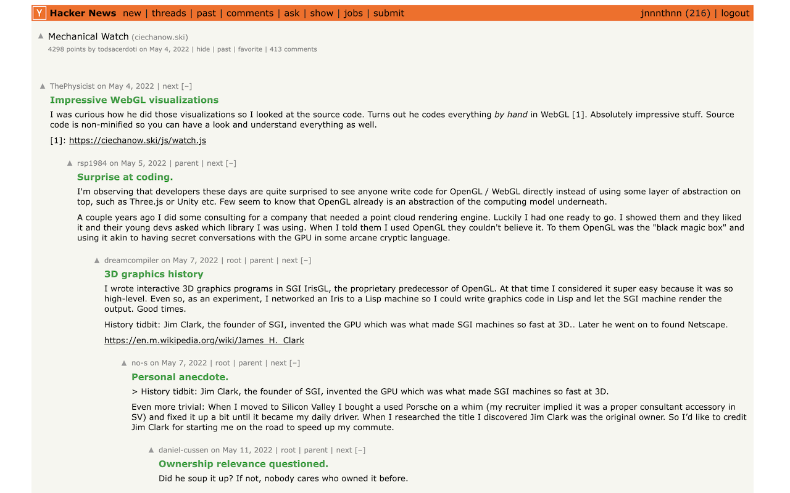

# Hacker News comment thread summarizer extension

August 29, 2024: the extension is now available for download on the [Chrome Web Store](https://chromewebstore.google.com/detail/hacker-news-comment-threa/lojogmipgnlkialinmaojdddkaddkiop)!

## What is this?

A Chrome extension that summarizes individual HN comments within their thread's context, allowing you to skim Hacker News (news.ycombinator.com) comment threads faster.

Uses an OpenAI API key provided by the user.

## How to install and use

1. Install the extension from the [Chrome Web Store](https://chromewebstore.google.com/detail/hacker-news-comment-threa/lojogmipgnlkialinmaojdddkaddkiop) (or clone this repository and [install it unpacked](https://developer.chrome.com/docs/extensions/get-started/tutorial/hello-world#load-unpacked))
1. Click on the extension icon in the Chrome toolbar (might be hidden behind a puzzle icon)
1. Add an OpenAI API key:
    1. Your API key is stored on your machine. Requests are made directly from browser tabs showing Hacker News threads.
    1. In principle, a malicious third-party extension could spy on those and steal your API key. Additionally, as the extension uses a very cheap model, it doesn't include built in cost controls. You're advised to use [OpenAI's project usage limits](https://help.openai.com/en/articles/9186755-managing-your-work-in-the-api-platform-with-projects#h_d2c8f84ece) as spend guardrails.
    1. The extension uses `gpt-4o-mini`. In our testing, reading a dozen or so HN posts a day resulted in about $0.02 in OpenAI usage costs (as of August 2024).
1. Navigate to any Hacker News post, and enjoy summaries for each comment!a

## How to contribute

Just open a PR! I threw this together in less than an hour, and would very much welcome improvements :)
